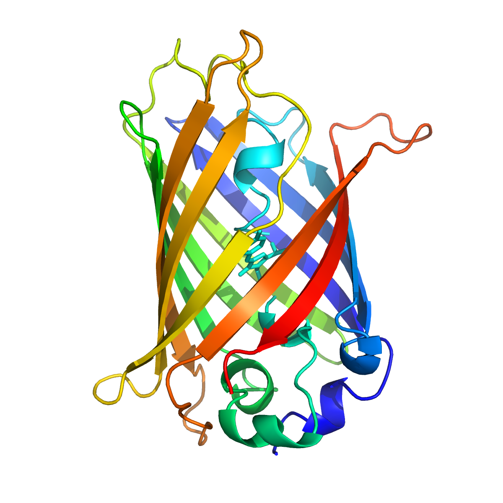
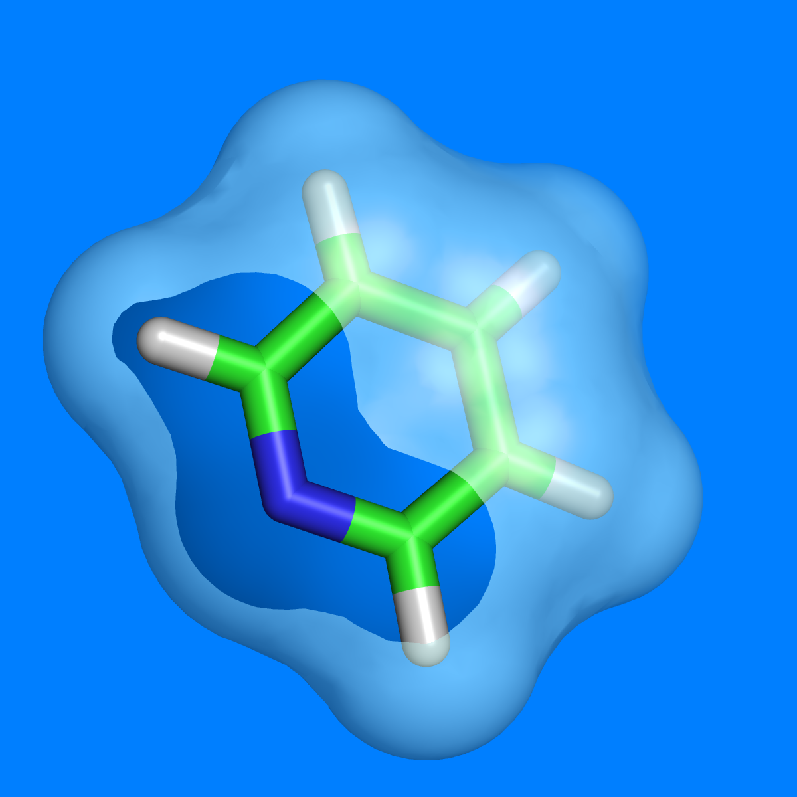

name: inverse
layout: true
class: center, middle, inverse
---
## Molecular Properties in Solution 

### The Good, the bad and the ugly

.author[Roberto Di Remigio]

.institution[UiT - The Arctic University of Norway]

.institution[Department of Chemistry - Virginia Tech]

.date[8 July 2019, Lille]

.footnote[[CC BY 4.0](https://creativecommons.org/licenses/by/4.0/) licensed.
Browse slides at [http://tinyurl.com/talk-lille](http://tinyurl.com/talk-lille)]

???

---
layout: false

.left-column[
## Outline
]
.right-column[
#### Coupled cluster theory
#### The diagrammatic approach
#### Stochastic coupled cluster
#### Bringing it all together
]

???

---
layout: false

## The Problem of Solvation

Aspects computational models need to capture
- Dynamical features of solvation
- Average nature of observables
- Variety of interactions

???

- Chemistry is a wet science: experiments mostly happen in solution.
- We can classify solvent effects as:
  * Direct: these effects stem straightforwardly from the modification
    underwent by the solute electronic density when interacting with the
    environment.
  * Indirect: it is common for solutes to exhibit different minimum-energy
    conformations in different environments. These effects are commonly
    labelled as indirect.
  * Local field: light-matter interactions are also affected by the
    environment. Local modifications of externally applied fields subtly
    influence molecular responses.
  * Dynamic: the presence of the environment radically influences excited
    states, since relaxation processes in the medium become important.
  * Specific:  This catch-all category includes all effects stemming from the
    peculiar solute-solvent pair interactions that cannot be fully described
    under any of the previous labels. In general, modelling such effects
    demands an atomistic level of detail.

Problems

- Size \\(\Leftrightarrow\\) accurate _ab initio_ not possible
- Conformations \\(\Leftrightarrow\\) statistical sampling

- Size is a huge problem. It is simply not possible to model large systems very
  accurately.
- Moreover, the conformational space is very large and needs to be sampled
  extensively to have meaningful results.

---
class: split-50-50

## Quantum/Classical Multiscale Models.red[1]

- Use **quantum** and **classical** physics together
  * quantum for chemically relevant subsystem
  * classical for the environment

.column[

]
.column[

]

.footnote-cite[.red[1] Senn, H. M.; Thiel, W. _Angew. Chem. Int. Ed._ (2009), __48__, 1198]

???

- The idea of multiscale models is to _focus_ on the chemically relevant part
  of the system and treat the environment approximately.

---
class: split-60-40

## QM/Continuum.red[2]

- Use **quantum** and **classical** physics together
  * quantum for chemically relevant subsystem
  * _continuum dielectric_ for the environment

.column[
.red[Pros]
- **Exact** electrostatics
- Self-consistent polarization
- Statistically averaged _by construction_

.red[Cons]
- **No** chemical detail in the environment
- Dispersion and repulsion approximate
]
.column[

]

.footnote-cite[.red[2] Tomasi, J.; Mennucci, B.; Cammi, R. _Chem. Rev._ (2005), __105__, 2999]

???

---
class: split-60-40

## QM/Continuum: The Polarizable Continuum Model.red[2]

.column[
### Transmission problem
`$$
  \begin{align}
  L_\mathrm{i} u &= \nabla^2 u = -4\pi\rho \,\, \text{in}\,\, \Omega_\mathrm{i} \label{eq:internal} \\
  L_\mathrm{e} u &= 0 \,\, \text{in}\,\, \Omega_\mathrm{e} \label{eq:external} \\
  [u](\mathbf{s}) &= u_\mathrm{e} - u_\mathrm{i} = 0 \,\, \text{on}\,\, \Gamma
  \label{eq:trace-jump} \\
[\partial_L u](\mathbf{s}) &= \partial_{L_\mathrm{e}} u - \partial_{L_\mathrm{i}} u = 0 \,\, \text{on}\,\, \Gamma \label{eq:conormal-jump} \\
|u(\mathbf{r})| &\leq C \|\mathbf{r} \|^{-1} \,\,\text{for}\,\,\| \mathbf{r} \|\rightarrow\infty
\label{eq:radiation}
\end{align}
$$`
]
.column[

]

.footnote-cite[.red[2] Tomasi, J.; Mennucci, B.; Cammi, R. _Chem. Rev._ (2005), __105__, 2999]

???

- Replace environment with continuum \\(\varepsilon\\)
- Create cavity in continuum \\(\Omega_i\\)
- Vacuum inside cavity \\(\varepsilon=1\\)
- Solute charge density _entirely_ in \\(\Omega_i\\)

- Model the solvent as a polarizable dielectric continuum
- Parameters for the definition of the boundary, i.e. the cavity
- Parameters describing the solvent: permittivity (static and optical)
- Notice that the solvent parameters are, _by definition_, averaged!
- \\(L_\star\\) are elliptic differential operators
- Trace operators are the extension of the concept of restriction of a function
  over a boundary to generalized functions in Sobolev space
- Conormal derivative extends the notion of a normal derivative to functions in
  Sobolev spaces
- \\(\sigma(\mathbf{s})\\) is called the apparent surface charge (ASC)

* \\(L_\star\\) are elliptic differential operators
* Dirichlet condition: \\([u] (\mathbf{s})\\)
* Neumann condition: \\([\partial_L u] (\mathbf{s})\\)

---
## Mathematics of PCM.red[3]

- Define the .red[reaction potential]
`$$
 u(\mathbf{r}) = \color{Blue}{\varphi(\mathbf{r})} + \color{Red}{\xi(\mathbf{r})}
 = \int_C \mathop{}\!\mathrm{d}\mathbf{r}^\prime \frac{\color{Blue}{\rho(\mathbf{r}^\prime)}}{|\mathbf{r} - \mathbf{r}^\prime|} +
  \int_{\partial C} \mathop{}\!\mathrm{d}\mathbf{s} \frac{\color{Red}{\sigma(\mathbf{s})}}{|\mathbf{r} - \mathbf{s}|}
$$`

- .red[Apparent surface charge (ASC)]
`$$
\color{Green}{\mathcal{T}}\color{Red}{\sigma(\mathbf{s})} = -\color{Green}{\mathcal{R}}\color{Blue}{\varphi(\mathbf{s})}
$$`

- Green's functions for \\(L_\star\\) define integral operators

`$$
 \begin{align}
  (\color{Green}{\mathcal{S}_\star} f)(\mathbf{s}) &=
\int_{\partial C} \mathop{}\!\mathrm{d}\mathbf{s}^\prime \color{Green}{G_\star(\mathbf{s}, \mathbf{s}^\prime)}f(\mathbf{s}^\prime) \\
  (\color{Green}{\mathcal{D}_\star} f)(\mathbf{s}) &=
\int_{\partial C} \mathop{}\!\mathrm{d}\mathbf{s}^\prime [\partial_{L_\star}^\prime\color{Green}{G_\star(\mathbf{s}, \mathbf{s}^\prime)}]f(\mathbf{s}^\prime) \\
  (\color{Green}{\mathcal{D}^\dagger_\star} f)(\mathbf{s}) &=
\int_{\partial C} \mathop{}\!\mathrm{d}\mathbf{s}^\prime [\partial_{L_\star}\color{Green}{G_\star(\mathbf{s}, \mathbf{s}^\prime)}]f(\mathbf{s}^\prime)
 \end{align}
$$`

.footnote-cite[.red[3] Cancès, E.; Mennucci, B. _J. Math. Chem._ (1998), __23__, 309]

???

- We've transformed a boundary value problem (BVP) into a boundary integral equation (BIE)
- Integral operators are defined in terms of traces and conormal derivatives
- The integral operators have well-defined mapping properties between Sobolev
  spaces of fractional order
- Knowledge of the Green's functions inside and outside the cavity is key to
  the method

---

## A PCM for All Seasons.red[3]

- Environments with anisotropies and nonuniformities
`$$
\begin{align}
\left[\left(2\pi\mathcal{I} - \color{Green}{\mathcal{D}_\mathrm{e}}\right)\color{Green}{\mathcal{S}_\mathrm{i}} +
      \color{Green}{\mathcal{S}_\mathrm{e}}\left(2\pi\mathcal{I} + \color{Green}{\mathcal{D}^\dagger_\mathrm{i}}\right) \right]&\color{Red}{\sigma(\mathbf{s})} = \\
&-\left[\left(2\pi\mathcal{I} - \color{Green}{\mathcal{D}_\mathrm{e}}\right) -
\color{Green}{\mathcal{S}_\mathrm{e}}\color{Green}{\mathcal{S}_\mathcal{i}^{-1}}\left(2\pi\mathcal{I} - \color{Green}{\mathcal{D}_\mathrm{i}}\right)\right]\color{Blue}{\varphi(\mathbf{s})}
\end{align}
$$`
- Isotropic environments
`$$
\left[ 2\pi \left(\frac{\varepsilon+1}{\varepsilon-1}\right)\mathcal{I} - \color{Green}{\mathcal{D}}\right]
\color{Green}{\mathcal{S}}\color{Red}{\sigma(\mathbf{s})} = -\left( 2\pi\mathcal{I} - \color{Green}{\mathcal{D}} \right)
\color{Blue}{\varphi(\mathbf{s})}
$$`
- Conductor-like boundary conditions
`$$
\color{Green}{\mathcal{S}}\color{Red}{\sigma(\mathbf{s})} = -f(\varepsilon)\color{Blue}{\varphi(\mathbf{s})}$$`

How to solve these?

.footnote-cite[.red[3] Cancès, E.; Mennucci, B. _J. Math. Chem._ (1998), __23__, 309]

???

---
class: split-70-30

## Boundary Element Method and PCM.red[4]

.column[
Solution by a boundary element method (BEM)

* Cavity of interlocking, atom-centered spheres
* \\(N_\mathrm{ts}\\) finite elements on the cavity boundary
* Form boundary integral operators
`$$
 \color{Green}{\mathbf{T}}\color{Red}{\mathbf{q}} = - \color{Green}{\mathbf{R}}\color{Blue}{\mathbf{v}}
$$`
* Solve linear system
]
.column[

]

- Similar equation for IEF-PCM, isotropic PCM and COSMO
- _Independent_ of QM method!

.footnote-cite[.red[4] Ern, A; Guermond, J.-L. _Theory and Practice of Finite Elements_, Springer, 2004]

???

- _Galerkin_ or _collocation_ method
- Direct inversion or iterative solver

---
## More Mathematics of PCM.red[5]

`$$
\left\{
\begin{aligned}
  &\text{Seek $\zeta \in V$ such that:}\\
  &\forall \zeta \in V \,\,\,\,\,
  \color{Red}{a(\zeta, \sigma)} = \color{Blue}{b(\zeta)}
\end{aligned}
\right.
$$`

**Lax-Milgram Lemma**

If the bilinear form \\(a\\) is _continous_ and _coercive_
in \\(V\\), then, for any linear form \\(b\\), the Problem is
_well-posed_.

**Variational Corollary**

If the bilinear form is _symmetric_ and _positive_
the unique solution to the Problem is
the _unique minimum_ on \\(V\\) of the functional:
`$$
  \mathcal{F}(\zeta) = \frac{1}{2}\color{Red}{a(\zeta, \zeta)} - \color{Blue}{b(\zeta)}
$$`

.footnote-cite[.red[5] Lipparini, F.; Scalmani, G.; Mennucci, B.; Cancès, E.; Caricato, M.; Frisch, M. J. _J. Chem. Phys._ (2010), __133__, 014106]

???

- Introduce a suitable vector space, equipped with a norm
  derived from a scalar product.
  The solution belongs to such a vector space, which is
  bigger that in the strong formulation (less constraints on
  the regularity of the solution)
- Hadamard well-posedness definition:
  The Problemis well-posed if it admits one and only
  one solution and the solution is bounded by the initial data, by
  an a priori estimate (see Ern&Guermond, p.82, Def. 2.1)
- Def. Continuity: A bilinear form on a normed vector space is
  bounded, or continuous, if there is a constant \\(C\\) such that for
  all \\(u, v \in V\\):
  `$$
    a(u, v) \leq C \lVert u\rVert \lVert v \rVert
  $$`
- Def. Coercivity: A bilinear form on a vector space is coercive,
  or elliptic, if there is a constant \\(c > 0\\) such that \\(\forall u
  \in V\\):
  `$$
    a(u, u) \geq c \lVert u\rVert^2
  $$`
  This implies that no eigenvalue of the linear operator associated
  to the bilinear form can be zero, hence that the operator is
  invertible!!

---

## Variational Formulation of the PCM.red[5]

Find \\(\color{Red}{\sigma(\mathbf{s})}\\) minimizing
`$$
U_\mathrm{PCM}[\color{Red}{\sigma(\mathbf{s})}]
=\frac{1}{2}\int_{\partial C} \mathop{}\!\mathrm{d}\mathbf{s} \color{Red}{\sigma(\mathbf{s})} \color{Green}{[\mathcal{R}^{-1}\mathcal{T}]} \color{Red}{\sigma(\mathbf{s})}
+\int_{\partial C} \mathop{}\!\mathrm{d}\mathbf{s} \color{Blue}{\varphi(\mathbf{s})}\color{Red}{\sigma(\mathbf{s})}
$$`

1. Physically meaningful
   - Unfavourable self-interaction of \\(\color{Red}{\sigma(\mathbf{s})}\\)
   - Favourable interaction of \\(\color{Red}{\sigma(\mathbf{s})}\\) and  \\(\color{Blue}{\varphi(\mathbf{s})}\\)

2. Equilibrium values are energies
3. Convexity

.footnote-cite[.red[5] Lipparini, F.; Scalmani, G.; Mennucci, B.; Cancès, E.; Caricato, M.; Frisch, M. J. _J. Chem. Phys._ (2010), __133__, 014106]

???

---

## The Importance of Being Variational.red[6]

1. Avoids nonlinear couplings in the QM Hamiltonian
2. _Classical_ Hellmann-Feynman theorem
`$$
\frac{\mathop{}\!\mathrm{d}U_\mathrm{pol}}{\mathop{}\!\mathrm{d} F} =
\frac{\partial U_\mathrm{pol}}{\partial F}
+\cancelto{0}{\frac{\partial U_\mathrm{pol}}{\partial \color{Red}{\mathrm{p}}}\frac{\partial \color{Red}{\mathrm{p}}}{\partial F}}
$$`
3. **Valid for polarizable MM models**
4. Extended Lagrangian dynamics

.footnote-cite[.red[6] Lipparini, F.; Lagardère, L.; Raynaud, C.; Stamm, B.; Cancès, E.; Mennucci, B.; Schnieders, M.; Ren, P.; Maday, Y.; Piquemal, J.-P.
_J. Chem. Theory Comput._ (2015), __11__, 623]

???

Classical polarization energy of mixed discrete-continuum system.
`$$
U_\mathrm{pol}[\mathrm{p}] = \frac{1}{2}\mathrm{p}\color{Green}{\mathbb{V}}\mathrm{p} + \mathrm{p}\mathrm{s}
$$`
- p is the polarization degree of freedom
- s is the source term
- V is the classical interaction operator
- \\(\mathrm{p}\\) is an _independent_ degree of freedom
- _linear_ QM/classical coupling through

---

## Self-Consistent Field with PCM...

* .blue[Molecular electrostatic potential (MEP)]
  `$$
  \varphi(\mathbf{s}) = \sum_{\kappa\lambda}^{N_\mathrm{AO}} \color{Blue}{\varphi_{\kappa\lambda}(\mathbf{s})} D_{\lambda\kappa},
  \quad
  \color{Blue}{\varphi_{\kappa\lambda}(\mathbf{s}) }= \int\mathop{}\!\mathrm{d}\mathbf{r} \frac{-\chi^*_\kappa(\mathbf{r})\chi_\lambda(\mathbf{r}) }{|\mathbf{r} - \mathbf{s}|}
  $$`
* .red[Apparent surface charge (ASC)]
  `$$
   \color{Green}{\mathcal{T}}\color{Red}{\sigma(\mathbf{s})} = - \color{Green}{\mathcal{R}}\color{Blue}{\varphi(\mathbf{s})}
  $$`
* Fock matrix
  `$$
   f_{\kappa\lambda} =
   f^\mathrm{vac}_{\kappa\lambda} +
    (\color{Red}{\sigma(\mathbf{s})}, \color{Blue}{\varphi_{\kappa\lambda}(\mathbf{s})})_{
  \partial C}
  $$`

???

---

## ...or indeed _any_ classical polarizable model

* .blue[Source term]
  `$$
  \mathrm{s} = \sum_{\kappa\lambda}^{N_\mathrm{AO}} \color{Blue}{\mathrm{s}_{\kappa\lambda}} D_{\lambda\kappa}
  $$`
* .red[Classical polarization]
  `$$
   \color{Green}{\mathbb{V}}\color{Red}{\mathrm{p}} = - \color{Blue}{\mathrm{s}}
  $$`
* Fock matrix
  `$$
   f_{\kappa\lambda} =
   f^\mathrm{vac}_{\kappa\lambda} +
    \color{Red}{\mathrm{p}} \color{Blue}{\mathrm{s}_{\kappa\lambda}}
  $$`

???

---
class: split-50-50

## Coupled cluster theory

.column[

]
.column[
`
$$
|\mathrm{CC}\rangle = \mathrm{e}^T |D_{\mathbf{0}}\rangle,
\quad
T = \sum_{u=1} T_u
$$
`
]

`
$$
T_u =
  \sum_{\substack{a_1\\ i_1}} t^{a_1}_{i_1}\tau_{i_1}^{a_1} +
  \frac{1}{4} \sum_{\substack{a_1, a_2 \\ i_1, i_2}} t^{a_1a_2}_{i_1i_2}\tau_{i_1i_2}^{a_1a_2} +
  \ldots +
  \frac{1}{(u!)^2} \sum_{\substack{a_1, a_2, \ldots, a_u \\ i_1, i_2, \ldots, i_u}}
t^{a_1a_2\ldots a_u}_{i_1i_2\ldots i_u}
\tau_{i_1i_2\ldots i_u}^{a_1a_2\ldots a_u}
$$
`

- Size-consistent and size-extensive
- Systematically improvable
- Polynomial scaling

???

- Construct the many-electron wavefunction as a multideterminantal expansion.
- Generate excited determinants from a single reference determinant.
- Excitations
- Wave operator is **not** unitary: `$\mathrm{e}^{-T} \neq \mathrm{e}^{T^\dagger}$`

---

## Coupled cluster equations: _unlinked_

`
$$
H_{\mathrm{N}}|\mathrm{CC} \rangle = \Delta E_{\mathrm{CC}}| \mathrm{CC} \rangle
$$
`

Assume _intermediate normalization_ `$ \langle D_{\mathbf{0}}| \mathrm{CC} \rangle = 1$`:

- Energy equation:

`
$$
\langle D_{\mathbf{0}} | H_{\mathrm{N}} |\mathrm{CC} \rangle =
\langle D_{\mathbf{0}} | H_{\mathrm{N}} (T_2 + T_1 + \frac{1}{2}T_1^{2})|D_\mathbf{0} \rangle =
\Delta E_{\mathrm{CC}}
$$
`

- Amplitude equations

`
$$
\langle D_{\mathbf{n}} | H_{\mathrm{N}} - \Delta E_{\mathrm{CC}} |\mathrm{CC} \rangle = 0
$$
`

- Size-extensive order-by-order, _not_ term-by-term

???

- Start from the normal-ordered Hamiltonian
- Project on reference determinant -> Get the energy (only singles and doubles needed)
- Project on excitation manifold -> Get amplitudes

---

## Coupled cluster equations: _linked_

`
$$
H_{\mathrm{N}}|\mathrm{CC} \rangle = \Delta E_{\mathrm{CC}}| \mathrm{CC} \rangle
$$
`

Assume _intermediate normalization_ `$ \langle D_{\mathbf{0}}| \mathrm{CC} \rangle = 1$`:

- Multiply by `$\mathrm{e}^{-T}$`:

`
$$
 \bar{H}_{\mathrm{N}} |D_\mathbf{0} \rangle =
\mathrm{e}^{-T} H_{\mathrm{N}} \mathrm{e}^{T} |D_\mathbf{0} \rangle = \Delta E_{\mathrm{CC}}| D_{\mathbf{0}} \rangle
$$
`

- Energy equation:

`
$$
\langle D_{\mathbf{0}} | \bar{H}_{\mathrm{N}} |\mathrm{CC} \rangle = \Delta E_{\mathrm{CC}}
$$
`

- Amplitude equations

`
$$
\langle D_{\mathbf{n}} | \bar{H}_{\mathrm{N}} | D_\mathbf{0} \rangle = 0
$$
`

- Size-extensive order-by-order _and_ term-by-term

???

- Start from the normal-ordered Hamiltonian
- Project on reference determinant -> Get the energy (only singles and doubles needed)
- Project on excitation manifold -> Get amplitudes

---

## From `$\bar{H}_\mathrm{N}$` to diagrams

- Baker-Campbell-Hausdorff expansion truncates

`
$$
\begin{aligned}
 \bar{H}_{\mathrm{N}} &=
       H_{\mathrm{N}} +
       [H_{\mathrm{N}}, T] +
       \frac{1}{2!}[[H_{\mathrm{N}}, T], T] \\ &+
       \frac{1}{3!}[[[H_{\mathrm{N}}, T], T], T] +
       \frac{1}{4!}[[[[H_{\mathrm{N}}, T], T], T], T]
\end{aligned}
$$
`

- Only connected terms contribute

???

- BCH truncates because the Hamiltonian is a two-body operator
- normal ordering, generalised Wick's theorem

---
count: false

## From `$\bar{H}_\mathrm{N}$` to diagrams

---
class: split-50-50

## Diagrammatic representation

.column[
### Excitors

]
.column[
### Hamiltonian

]

???

- Hole and particle lines
- Hamiltonian pieces

---
class: split-50-50

## Diagrammatic representation, contd.

.column[
### Excitors

]

.column[
### Hamiltonian

]

---

???

- We represent contractions with connecting lines
- Internal _vs_ external lines. The former are summed over.
- Loops, equivalent lines, signs, permutations

---

## Solving the coupled cluster equations

- Derive equations from diagrams
- Factorise nonlinear terms

???

- An explosion of terms, can be automated, but factorisation is nontrivial
- Dense algebra, nontrivial to parallelise

---
layout: false

## From deterministic to stochastic.red[1]

- Finite-different imaginary-time propagation

`
$$
| \Psi(\tau+\delta\tau) \rangle = [1 - \delta\tau(H - S)] | \Psi(\tau) \rangle
$$
`

- Modified CC Ansatz

`
$$
| \mathrm{CCMC} \rangle = N_{0}\mathrm{e}^{\frac{T^\prime}{N_0}} |D_{\mathbf{0}}\rangle
$$
`

where `$ \langle D_{\mathbf{0}}| \mathrm{CCMC}(\tau) \rangle = N_0(\tau)$`

- _Unlinked_ dynamic equation

`
$$
t_{\mathbf{n}}(\tau+\delta\tau) = t_{\mathbf{n}}(\tau) - \delta\tau
  \langle D_{\mathbf{n}} | H - S | \mathrm{CCMC}(\tau) \rangle
$$
`

.footnote-cite[.red[1] Thom, A. J. W. _Phys. Rev. Lett._ (2010), **105**, 263004]

???

- Sample the wavefunction
- Sample action of Hamiltonian
- Whereas results will be size-extensive and consistent, terms to sample may
not scale linearly with system size, even for perfectly noninteracting systems.

---
## Size extensivity and memory cost

???

- These are noninteracting replicas of Be atoms. Easy system.
- Cost is emphatically growing faster than linear.
- Why so? We are sampling terms that cancel out exactly in the end, but we're
still doing that part of the work and using memory for it.

---
## Learning new tricks from an old dog

- Imaginary-time Schrödinger equation.red[2]
`
$$
\frac{\mathrm{d}}{\mathrm{d}\tau} | \mathrm{CC} \rangle = -H | \mathrm{CC} \rangle
$$
`

- _Constant_ intermediate normalization
`
$$
\frac{\mathrm{d}t_{\mathbf{n}}}{\mathrm{d}\tau} = - \langle D_{\mathbf{n}} | \bar{H}_{\mathrm{N}}(\tau) | D_\mathbf{0} \rangle
$$
`

- Finite difference
`
$$
t_{\mathbf{n}}(\tau+\delta\tau) = t_{\mathbf{n}}(\tau) - \delta\tau\langle D_{\mathbf{n}} | \bar{H}_{\mathrm{N}}(\tau) | D_\mathbf{0} \rangle
$$
`

.footnote-cite[.red[2] Pigg, D. A.; Hagen, G.; Nam, H.; Papenbrock, T. _Phys. Rev. C Nucl. Phys._ (2012), **86**, 014308]

???

- Use the linked formulation, because terms are size-extensive by construction
- Rather than sample the commutator expansion, as done by Franklin _et al._,
enforce connectedness by using diagrammatic techniques.

---
## Diagrammatic Coupled Cluster Monte Carlo.red[3]

`
$$
t_{\mathbf{n}}(\tau+\delta\tau) = t_{\mathbf{n}}(\tau) - \delta\tau\textcolor{red}{\langle D_{\mathbf{n}} | \bar{H}_{\mathrm{N}}(\tau) | D_\mathbf{0} \rangle}
$$
`

### Idea and Plan

- The _residual_ integral `$\textcolor{red}{\langle D_{\mathbf{n}} | \bar{H}_{\mathrm{N}}(\tau) | D_\mathbf{0} \rangle} = \sum \mathrm{diagrams}$`
- Build diagrams on the fly, _stochastically_
- _Stochastic_ rounding of amplitudes.

???

- The red terms is a sum of diagrams. We can devise an algorithm to sample this
integral by building diagrams on the fly
- Stochastic rounding ensures sparse representation.
- Additionally this can be interpreted on par with deterministic approaches!

.footnote-cite[.red[3] Scott, C. J. C.; Di Remigio, R.; Crawford, T. D.; Thom, A. J. W. _J. Phys. Chem. Lett._ (2019), **10**, 925]

---

.footnote-cite[Animation courtesy Katia Di Antonio]

---
## Size extensivity and memory cost, contd.

---
## CPU cost

---
## Locality

---
## Acknowledgements

---
name: last-page
template: inverse

# Thanks for your attention!

Slideshow created using [remark] and served using [cicero]

Slides available on [GitHub](https://github.com/robertodr/talk-lille)

Browse slides at [http://tinyurl.com/talk-lille](http://tinyurl.com/talk-lille)

[remark]: https://github.com/gnab/remark
[cicero]: https://github.com/bast/cicero
